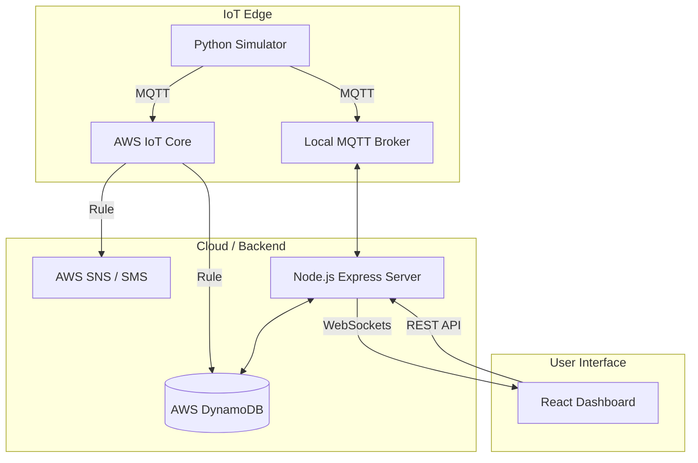

# 🌊 AquaGuard Bengaluru: Smart Water Leak Detection System

[](https://react.dev/)
[](https://nodejs.org/)
[](https://www.python.org/)
[](https://aws.amazon.com/)

**AquaGuard Bengaluru** is a full-stack IoT solution designed to monitor the water distribution grid of Bengaluru. It uses high-fidelity sensor simulation to detect leaks in real-time, visualize telemetry data on interactive maps, and manage incident resolution workflows for municipal authorities.

---

## 🚀 Key Features

-   **Real-time IoT Telemetry**: Monitor Pressure (bar), Flow Rate (L/min), Vibration (Hz), and Battery levels across 32 pipeline nodes.
-   **Smart Leak Detection**: Automated detection of anomalies such as sudden pressure drops and flow surges.
-   **Interactive Dashboard**: GIS-integrated map showing node health, leak severity (Low, Medium, High, Critical), and live charts.
-   **Incident Management**: Dedicated alerts page for staff assignment and leak resolution tracking.
-   **Authority-only Registration**: Secure signup process requiring a specific authority code for municipal staff.
-   **Cloud Native Architecture**: Fully integrated with AWS IoT Core for ingestion and DynamoDB for historical storage.

---

## 🏗️ System Architecture



---

## 🛠️ Tech Stack

-   **Frontend**: React 19, Vite, Leaflet.js, React Google Maps, CSS3 (Glassmorphism).
-   **Backend**: Node.js, Express, WebSocket (ws), MQTT.js, Aedes (Local Broker).
-   **IoT Simulator**: Python 3, Paho-MQTT, SSL/TLS.
-   **Cloud Infrastructure**: AWS IoT Core, DynamoDB, SNS, Lambda.

---

## 🔧 Installation & Setup

### 1. Prerequisites
-   Node.js (v18+)
-   Python (3.9+)
-   AWS CLI configured (optional, for cloud mode)

### 2. Backend Setup
```bash
cd backend
npm install
# Create a .env file with your AWS credentials/region
node server.js
```
*The backend automatically starts a local MQTT broker if no remote broker is specified.*

### 3. Frontend Setup
```bash
cd frontend
npm install
npm run dev
```
*Access the dashboard at `http://localhost:5173`.*

### 4. IoT Simulator Setup
```bash
cd iot-simulator
# Recommendation: use a venv
pip install paho-mqtt
python simulator.py --interval 3.0
```
*To run in local mode: `python simulator.py --local`*

---

## 🔑 Authority Credentials

To register a new staff account on the dashboard, use the following **Authority Code**:
`Waterleakauthority100281`

---

## 📂 Project Structure

```text
├── backend/            # Express server, WebSocket logic, DynamoDB integration
├── frontend/           # React application, Map components, Dashboard UI
├── iot-simulator/      # Python script simulating 32 pipeline nodes in Bengaluru
├── aws-setup.sh        # Infrastructure automation scripts
└── README.md           # This file
```

---

## 📜 API Documentation

| Endpoint | Method | Description |
| :--- | :--- | :--- |
| `/api/sensors` | `GET` | Get latest readings for all nodes |
| `/api/leaks` | `GET` | Get list of recent leak incidents |
| `/api/leaks/history` | `GET` | Fetch historical leak data from DynamoDB |
| `/api/auth/register`| `POST`| Register new authority user |
| `/api/health` | `GET` | System health and MQTT status |

---

## 🚢 Deployment

-   **Frontend**: Optimized for [Vercel](https://vercel.com) or Netlify.
-   **Backend**: Can be deployed to AWS EC2 or Elastic Beanstalk.
-   **Infrastructure**: Use the provided `aws-setup.sh` to provision the required IoT Core and DynamoDB resources.

---

*Developed for the Bengaluru Water Supply and Sewerage Board (BWSSB) - Simulation Prototype.*
